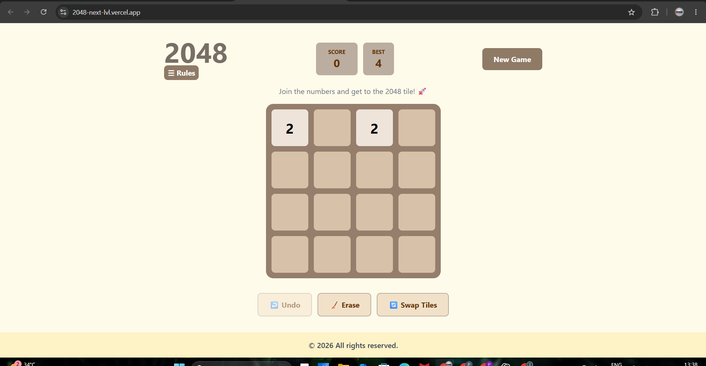
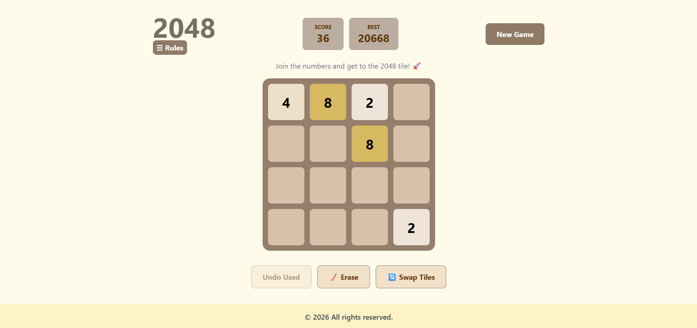

# 🎮 2048 Power Edition

A modern and feature-rich implementation of the classic **2048 puzzle game**, built with React and Tailwind CSS. This version extends the original gameplay with strategic power-ups, responsive controls, persistent score tracking, and a polished user experience across desktop and mobile devices.

🔗 **Live Demo:** [Play Now](https://2048-next-lvl.vercel.app/)

---

## ✨ Features

### 🎯 Core Gameplay

* Classic 2048 tile-merging mechanics
* Dynamic tile spawning
* Real-time score tracking
* Win detection upon reaching the 2048 tile
* Automatic game-over detection
* Continue playing after winning

### ⚡ Strategic Power-Ups

* **Undo** – Revert your previous move
* **Erase Tile** – Remove an unwanted tile from the board
* **Swap Tiles** – Exchange the positions of two tiles strategically

### 📱 Responsive Experience

* Fully responsive design
* Keyboard controls for desktop users
* Swipe gesture support for mobile devices
* Optimized gameplay across screen sizes

### 💾 Persistence

* Best score saved using Local Storage
* Progress maintained across browser refreshes

### 🎨 User Experience

* Animated tile spawning
* In-game rules modal
* Interactive win and game-over overlays
* Clean and intuitive interface

---

## 🛠️ Tech Stack

* **React**
* **JavaScript (ES6+)**
* **Tailwind CSS**
* **Vite**

---

## 🎮 Controls

### Desktop

| Key | Action     |
| --- | ---------- |
| ⬆️  | Move Up    |
| ⬇️  | Move Down  |
| ⬅️  | Move Left  |
| ➡️  | Move Right |

### Mobile

* Swipe Up
* Swipe Down
* Swipe Left
* Swipe Right

---

## 📂 Project Structure

```text
src
├── Components
│   ├── Footer.jsx
│   ├── Functions.jsx
│   ├── GameHeader.jsx
│   ├── GameLogic.js
│   ├── GameStatus.jsx
│   ├── Powers.jsx
│   ├── Rules.jsx
│   └── Tile.jsx
│
├── Board.jsx
├── App.jsx
├── main.jsx
└── index.css
```

---

## 🚀 Getting Started

### Clone the Repository

```bash
git clone  https://github.com/PritamBagle451/2048-next-lvl.git
```

### Navigate to the Project Directory

```bash
cd 2048-next-lvl
```

### Install Dependencies

```bash
npm install
```

### Start Development Server

```bash
npm run dev
```

### Build for Production

```bash
npm run build
```

---

## 📸 Screenshots

### Home Screen



### Gameplay



---

## 🧠 Learning Outcomes

This project provided practical experience with:

* React state management
* Custom React hooks
* Component-based architecture
* Event handling and touch interactions
* Local Storage persistence
* Responsive UI development
* Game logic implementation
* Modern frontend development workflows

---

## 🔮 Future Enhancements

* Dark Mode
* Multiple Board Sizes
* Sound Effects
* Advanced Tile Animations
* Global Leaderboards
* Achievement System

---

## 👨‍💻 Author

**Pritam Bagle**
B.Tech Student, IIT Hyderabad

Passionate about Web Development, Problem Solving, and Building Interactive User Experiences.

